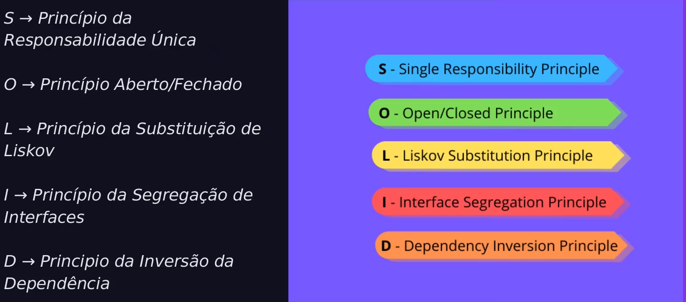

# Estudos de SOLID com Python



## Sobre o Repositório

Este repositório contém exemplos práticos sobre os princípios do SOLID aplicados à programação em Python. 

## Conteúdo

### 1. Princípio da Responsabilidade Única (SRP)
Neste módulo, explico como cada classe ou módulo deve ter uma única responsabilidade. Demonstro a separação de responsabilidades utilizando exemplos práticos, facilitando a manutenção e a compreensão do código.

**Commit:** `feat: implementation of single responsibility principle (SRP) with practical example`

### 2. Princípio Aberto/Fechado (OCP)
Discuti como um artefato de software deve ser aberto para extensão, mas fechado para modificação. Mostrei como estruturar o código para permitir a adição de novos comportamentos sem modificar a classe principal.

**Commit:** `feat: application of the Open/Closed principle (OCP) with example refactored code`

### 3. Princípio de Substituição de Liskov (LSP)
Demonstrei a importância de que objetos possam ser substituídos por seus subtipos sem afetar a execução do programa. Refatorei exemplos para respeitar a hierarquia de herança e garantir o comportamento esperado.

**Commit:** `feat: application of the Liskov substitution principle (LSP) with example of inheritance hierarchy`

### 4. Princípio de Segregação de Interfaces (ISP)
Expliquei como interfaces devem ser específicas e segregadas, evitando métodos desnecessários para implementações. Refatorei uma interface genérica para documentos, criando interfaces menores e mais específicas para cada tipo de documento.

**Commit:** `feat: implementation of the Interface Segregation principle (ISP) with specific interfaces for each type of document`

### 5. Princípio de Inversão de Dependência (DIP)
Expliquei como depender de abstrações em vez de concretizações, criando interfaces para garantir que módulos de alto e baixo nível não sejam acoplados diretamente. Demonstrei como isso torna o código mais flexível e maleável.

**Commit:** `feat: implementation of the Dependency Inversion principle (DIP) using interfaces for abstractions`

## Como Usar

1. Clone o repositório:
   ```bash
   git clone https://github.com/devGabyAlves/solid-python-concepts.git

2. Navegue até o diretório do projeto:
    ```bash
    cd solid-python-concepts
    ```

3. Explore os exemplos em cada pasta correspondente a um princípio do SOLID.

## Contribuição

Sinta-se à vontade para contribuir com melhorias ou novos exemplos para este repositório. Você pode abrir uma issue ou enviar um pull request.

## Contribuição

Este projeto está licenciado sob os termos da MIT License.